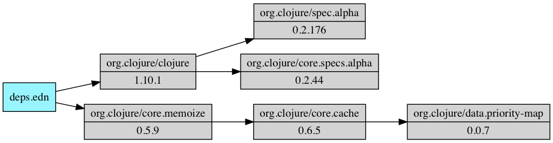

tools.deps.graph
========================================

A tool for making deps.edn dependency graphs.



# Dependencies

tools.deps.graph uses [Graphviz](https://www.graphviz.org/) to generate images. You can find a list of platform-specific installations at https://graphviz.gitlab.io/download/.

# Usage

Add tools.deps.graph as an alias in your ~/.clojure/deps.edn so it's available in any project:

```clojure
{...
 :aliases
 {:graph {:deps {org.clojure/tools.deps.graph {:mvn/version "0.2.30"}}
          :main-opts ["-m" "clojure.tools.deps.graph"]}}}
```

Run it in your current project:

```
clj -A:graph <options>
```

Run `clj -A:graph -h` for available options:

```
usage: clj -A:graph <options>

Options:
  -d, --deps DEPSFILE                deps.edn               deps.edn file to read, default ./deps.edn
  -t, --trace                                               Trace mode, output one image per trace step
  -f, --tracefile TRACEFILE                                 Read trace directly from file, output one image per trace step
  -h, --help
  -o, --output-file FILE             deps                   Basename of output-file without extension
      --output-format OUTPUT_FORMAT  :viewer                Either png, pdf, svg, or viewer
  -a, --aliases ALIASES                                     Concatenated alias names to enable
      --trace-omit LIBS              [org.clojure/clojure]  Comma delimited list of libs to omit in trace imgs
      --size                                                Include sizes in dep graph nodes
```

# Examples

```
clj -A:graph
```

Write the dependency graph for the current project to `deps.pdf`.

```
clj -A:graph
```

Same as above including java sizes

```
clj -A:graph  --size
```

Save dependency graph for `mydeps.edn`

```
clj -A:graph -d mydeps.edn -output-file mydeps --output-format pdf
```

Read mydeps.edn, create deps graph, output image to mydeps.png

```
clj -A:graph -t -o mydeps --output-format png
```

Read deps.edn, trace expansion, output steps as trace100, trace101, ...

```
clj -A:graph -d mydeps.edn -t -o trace --output-format svg
```

Read mydeps.edn, trace expansion, output trace100.png, ...

```
clj -Strace
clj -A:graph -f trace.edn -o trace --output-format svg
```

Use -Strace to output a trace.edn file.
Read trace.edn file, output trace100.png, ...

# Release Information

This project follows the version scheme MAJOR.MINOR.COMMITS where MAJOR and MINOR provide some relative indication of the size of the change, but do not follow semantic versioning. In general, all changes endeavor to be non-breaking (by moving to new names rather than by breaking existing names). COMMITS is an ever-increasing counter of commits since the beginning of this repository.

Latest release: 0.2.30

* [All released versions](http://search.maven.org/#search%7Cgav%7C1%7Cg%3A%22org.clojure%22%20AND%20a%3A%22tools.deps.graph%22)

[deps.edn](https://clojure.org/guides/deps_and_cli) dependency information:

```
org.clojure/tools.deps.graph {:mvn/version "0.2.30"}
```

# Developer Information

* [GitHub project](https://github.com/clojure/tools.deps.graph)
* [How to contribute](https://clojure.org/community/contributing)
* [Bug Tracker](https://dev.clojure.org/jira/browse/TDEPS)
* [Continuous Integration](https://build.clojure.org/job/tools.deps.graph/)
* [Compatibility Test Matrix](https://build.clojure.org/job/tools.deps.graph-test-matrix/)

# Copyright and License

Copyright © 2019 Rich Hickey, Alex Miller, and contributors

All rights reserved. The use and
distribution terms for this software are covered by the
[Eclipse Public License 1.0] which can be found in the file
epl-v10.html at the root of this distribution. By using this software
in any fashion, you are agreeing to be bound by the terms of this
license. You must not remove this notice, or any other, from this
software.

[Eclipse Public License 1.0]: http://opensource.org/licenses/eclipse-1.0.php
